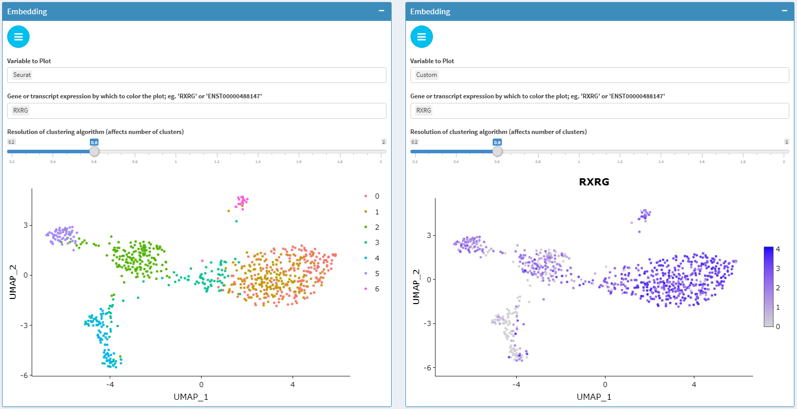
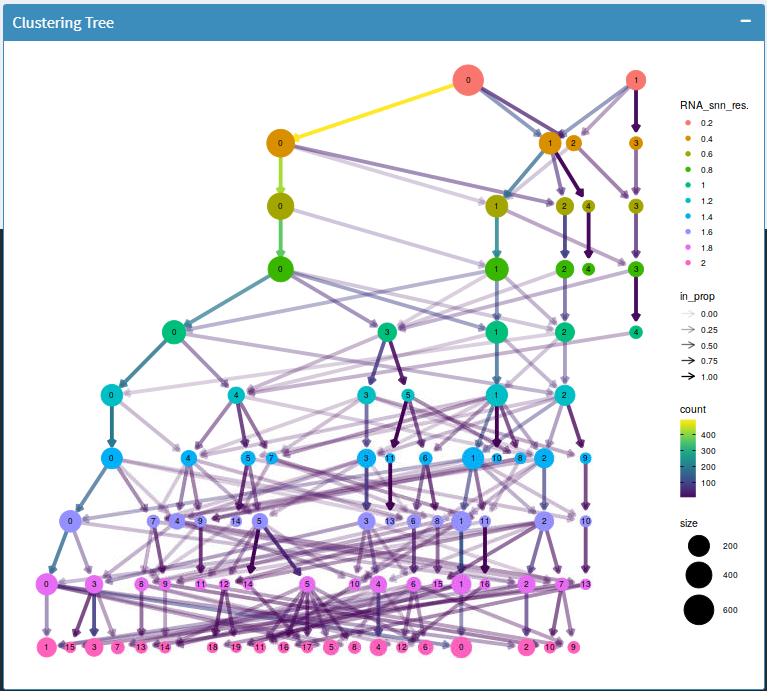
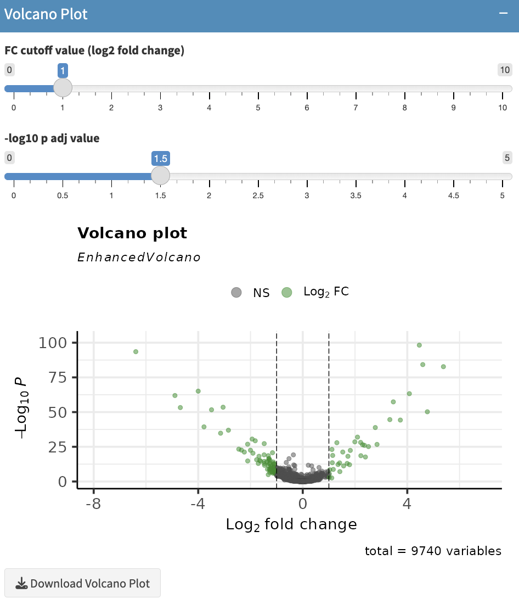
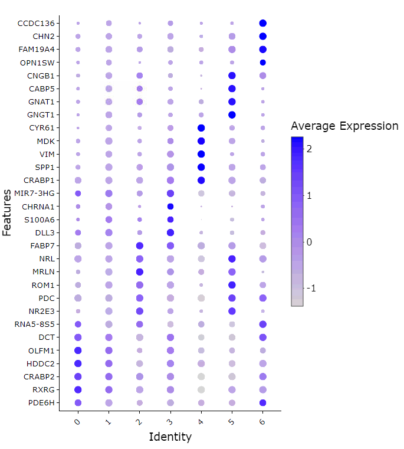
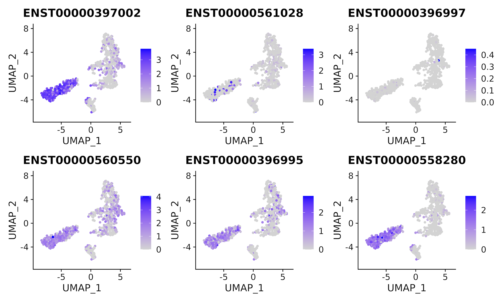
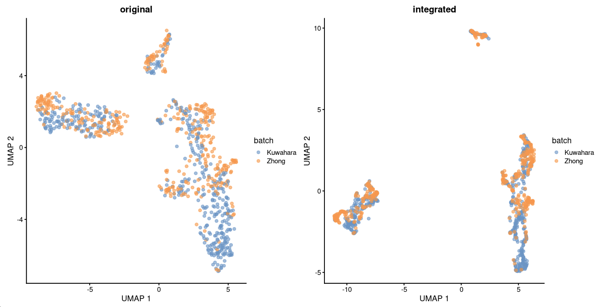

```{r, include = FALSE}
knitr::opts_chunk$set(
    collapse = TRUE,
    comment = "#>",
    # dev.args = list(png = list(type = "cairo")),
    dpi = 900,
    out.width = "100%",
    message = FALSE,
    warning = FALSE,
    crop = NULL ## Related to https://stat.ethz.ch/pipermail/bioc-devel/2020-April/016656.html
)

library(kableExtra)
```


Chevreul allows exploratory data analysis of a single cell dataset processed 
using `SingleCellExperiment` with the command `minimalSceApp()`

Here we'll provide a brief tour of this app organized by section with app
functions organized as tabs along the sidebar upon startup.

### Reformat Metadata 

Arbitrary variables can be appended to the cell metadata based on the results
of exploratory data analysis. 

Metadata addition can be executed by uploading a csv with row names matching 
cell ids with new variables as columns. Metadata editing can also be 
accomplished using a built-in spreadsheet tool. 

### Plot Data

#### Dimensional reduction plots 
chevreul provides visualization of embeddings in PCA, tSNE, and UMAP for 
scRNAseq data summarized at the gene and transcript level. 
Plots can be customized to display cell metadata and the results of community 
detection clustering by Louvain or Leiden algorithms as implemented in 
SingleCellExperiment. 
In addition, gene and transcript feature expression can be overlaid on 
embedding plots both at the gene and transcript level. 



#### read/UMI count histograms 
To facilitate quality control, cell-level summarized UMI and read 
count values can also be overlaid with cell metadata and clustering results.   


#### Clustering trees

A cluster tree of cell identities is displayed using [scclustviz](https://lazappi.github.io/clustree/articles/clustree.html). 
This plot can be used to help establish an optimal clustering resolution. 

In order to use this function `library(clustree)` must be loaded. 



### Heat Maps/Violin Plots

#### _Heat Maps_

When plotting the heat map, gene/transcript expression values for each 
cell are normalized by that cell's total expression then multiplied by 
10,000 and natural-log transformed before plotting. 

Clustering model or metadata for column arrangement is taken as a parameter
to produce a complex heat map.

By default, 50 most highly variable genes are displayed. However, an 
arbitrary lists of genes can be plotted for comparison. The genes/transcripts 
are displayed in the order they are listed. 


#### _Violin Plots_

Feature (gene or transcript) expression can be viewed by violin plot 
based on sample metadata

Violin plots are a hybrid of density and box plots. It shows the probability
density of the data at different values providing a visual representation 
of distribution of expression level of a feature in different groups of cell.
The horizontal line is a marker for the median of the data and the box shows
the interquartile ranges.

The parameters that could to be chosen here are:
1. 'Grouping variable'
2. 'Data Type (Transformed/Raw)'


### Differential expression

Chevreul provides different methods of differential expression analysis that 
users can choose from to determine differential expression of gene. DE methods 
included in Chevreul are t-test, Wilcoxon rank-sum test, and pairwise binomial 
test.

Running DE testing results in a data frame containing the following information:
*  p_val : Unadjusted p-value 
*  avg_log2FC : log fold-change of the average expression between the two groups.
*  pct.1 : The percentage of cells where the feature is detected in the first 
group
*  pct.2 : The percentage of cells where the feature is detected in the second 
group
*  p_val_adj : Adjusted p-value, based on bonferroni correction using all features
in the dataset.

```{r, eval = FALSE}
d1 <- read.csv("Dominic.csv", header = TRUE)
```

#### _Volcano Plots_

The results of differential expression analyses can be visualized using a 
volcano plot. This plot helps in visual identification of genes with large
fold changes that are also statistically significant. 


### Find Markers

Marker features based on louvain/leiden cluster identities or cell metadata 
can be defined based on results of wilcoxon rank-sum test. Variable numbers of
marker genes per cell group can be specified based on adjusted p value and
thresholded log fold change.



### Subset SingleCellExperiment Input

It is often useful to subset a single cell data set based on cell 
metadata whether experimentally determined (age, collection method, etc.) 
or derived from analysis (quality control metrics, annotated cell type)

chevreul makes it simple to subset a dataset consisting of a single batch 
or batch-integrated dataset. Subsetting can be accomplished either in a 
graphical setting by lasso-selection from a dimensionally reduced plot or
by by specification of a formatted .csv file. 

Subsetting of single or batch integrated data will trigger renewal of all 
relevant preprocessing steps including dimensional reduction, clustering, 
marker gene, and pathway enrichment as well as integration based
on a 'batch' variable

### All Transcripts

If expression is summarized with both gene and transcript experiments, it is 
possible to plot all constituent transcripts (labeled by ensembl transcript ids)
making up a given gene.

The two parameters that must be chosen are:

1. dimensional reduction method: PCA, UMAP or tSNE
2. The name of the gene of interest 



Direct comparison of the contribution of individual transcripts can be achieved
using stacked bar plots to answer the question: What contribution does each 
transcript make for each gene expression?


### Regress Features

To correct for expression variation in analysis due to phenomena unrelated to
focus of the study, rather than excluding count values attributable to such 
process, we can adjust the expression of all remaining genes or transcripts 
in each cell based on the sum score of relevant genes, to regress out cell-cycle
effects.

### Technical information

Technical information regarding upstream processing, software version numbers, 
and dataset features can be viewed. 


## Server Mode
If we want work with objects interactively and save the results of our 
exploratory data analysis we need to operate chevreul in *server mode*. 
When operating in this manner it is possible to carry out basic project 
management tasks including:
* Loading saved objects 
* Saving objects after making changes in the app such as :
  * Reformatting metadata 
  * Subsetting to remove cells
  * Regressing feature expression as well as
* Integrating multiple saved objects 

Finally, server mode is necessary for some expanded functionality including:
* Coverage plotting

*server mode* requires access to a few sqlite databases with file path details 
stored in `~/.cache/chevreul`. `single_cell_projects.db` and `bigwig_files.db` 
allowing dynamic loading of objects and bigwig (.bw) sample coverage files for 
each cell. These are initialized upon package installation using the 
`creat_project_db` function.

The following sections will give details on this expanded functionality.

### Integrate Projects

While operating Chevreul in server mode, separate sequencing batches can be 
[integrated](https://www.cell.com/cell/fulltext/S0092-8674(19)30559-8) and 
compared to validate sample processing steps and exclude technical variation in 
favor of relevant biological variation. 

{width=80% height=80%}

This section includes a list of projects that can be selected, integrated, and 
saved for future analysis.

### Coverage plots

Fine-grained analysis of isoform contributions can be achieved by plotting 
absolute read coverage plots across a given gene. 

indicate the **read depths across all transcripts for different groups of cells 
within a genomic region. 

The three user input parameters are:
1. 'Select a gene'- Select a gene of interest
2. 'Color by variable'- Select a variable by which to group the cells by
3. 'Groups to display'- Select the groups to be displayed

{width=80% height=80%}

## Session information

```{r reproduce3, echo=FALSE}
## Session info
library("sessioninfo")
options(width = 120)
sessionInfo()
```

